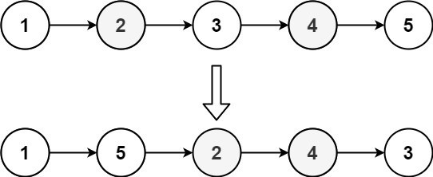

# 🟡 Reorder List

You are given the head of a singly linked-list. The list can be represented as:

```
L0 → L1 → … → Ln - 1 → Ln
```

_Reorder the list to be on the following form:_

```
L0 → Ln → L1 → Ln - 1 → L2 → Ln - 2 → …
```

You may not modify the values in the list's nodes. Only nodes themselves may be changed.

<figure><figcaption></figcaption></figure>


```python
class Solution:
    def reverseList(self, head):
        if head is None:
            return head

        prev = None
        curr = head

        while curr:
            nxt = curr.next
            curr.next = prev
            prev = curr
            curr = nxt

        return prev

    def mergeLists(self, head1, head2):
        dummy = ListNode()
        tail = dummy

        while head1 is not None and head2 is not None:
            tail.next = head1
            head1 = head1.next
            tail = tail.next

            tail.next = head2
            head2 = head2.next
            tail = tail.next

        if head1 is not None: # head1 can have an extra element
            tail.next = head1

        return dummy.next


    def reorderList(self, head: Optional[ListNode]) -> None:
        """
        Do not return anything, modify head in-place instead.

        Solution:
        - Get the first half and second half of the linked list. If there are odd numbers, take the extra element in the first half
        - Reverse the second half
        - Merge the two linked lists using dummy node

        TC: O(n) + O(n/2) + O(n) = O(n)
        SC: O(1)
        """

        # base cases of empty LL or LL with single node
        if head is None or head.next is None:
            return

        ptr1, ptr2 = head, head.next # this is to get the ptr1 to stop iterating at the end of first half

        while ptr2 and ptr2.next:
            ptr1 = ptr1.next
            ptr2 = ptr2.next.next

        # ptr1 points at the last element of first half 
        second_half = ptr1.next 
        ptr1.next = None

        # reverse the second half
        second_half = self.reverseList(second_half)

        # merge the two linked list starting with one element from list1 and then one element from list2
        head = self.mergeLists(head, second_half)

        return
```

